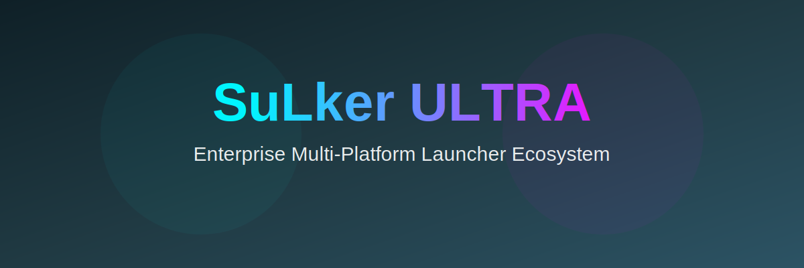

  

<h1 align="center">🚀 SuLker ULTRA</h1>

  Enterprise Multi-Platform Launcher Ecosystem

  
  
  
  
  
  

---

## 🌍 About

**SuLker** is an ultra-level, enterprise-ready launcher ecosystem built for:

- 📱 iOS (SwiftUI)
- 🤖 Android (Java)
- 🌐 Web
- ⚙️ C++ Core Engine
- ☁️ Cloud Backend

Designed with modern architecture, CI/CD, and security in mind.

---

## 🎮 Game Catalog Preview

Supports catalog entries like:

- Minecraft  
- Terraria  
- Geometry Dash  

(Links open official stores)

---

## 📸 Screenshots

### 📱 iOS

### 🤖 Android

### 🌐 Web

---

## 🏗 Architecture
